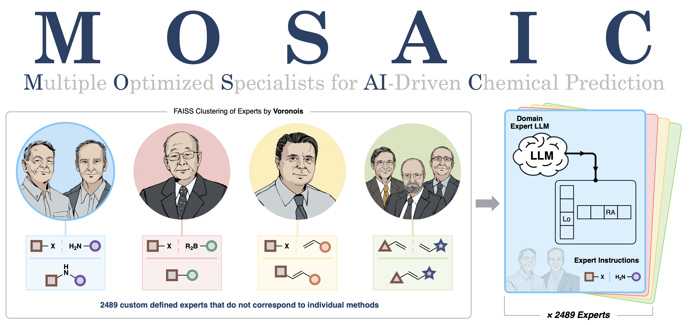

<p align="center">
  
</p>

This repository contains the official implementation of "Scaling Large Language Models for AI-Driven Chemical Synthesis".

## Overview

MOSAIC is a computational framework that fine-tunes the open-source Llama 3.1-8B-instruct model into 2,489 specialized chemistry experts. MOSAIC implements a scaling search paradigm that partitions and navigates chemical space through Voronoi regions.

## Requirements

```bash
python>=3.11.9
numpy==1.23.5
torch==2.4.1
pandas==1.5.3
rdkit==2023.9.6
tqdm==2.4.41
matplotlib==3.9.1
faiss==1.7.4
transformers==4.45.1
peft==0.12.0
trl==0.11.1
datasets==3.0.0
python-Levenshtein==0.26.0
```

For a complete list of dependencies, see [requirements.txt].

## Installation

1. Clone the repository:
```bash
git clone https://github.com/haoteli/MOSAIC.git
cd MOSAIC
```

2. Install dependencies:
```bash
pip install -r requirements.txt
```

3. Set up the Pistachio database, or use any custom databases

## Project Structure

```
MOSAIC/
├── DataProcessing/
│   ├── Get_Molecular_FP_MultiProcessing_LargeRAM.ipynb  # Generate molecular fingerprints
│   └── Create_Voronoi_Domains.ipynb                     # Train FAISS and obtain Voronoi breakdown
├── KernelMetricNetwork/
│   └── OneNotebookForAll.ipynb                         # Train kernel metric network
├── PredictionUtils/                                     # Core utilities for predictions
│   ├── ChemUtils.py                                    # Chemistry/RDKit related utilities
│   ├── NLPUtils.py                                     # NLP/referencing utilities
│   ├── PredictionUtils.py                              # Main prediction functions
│   ├── Transformation_Model.py                         # kernel metric network
│   └── run_prediction.sh                               # bash execution script
├── Training/
│   ├── DownloadingModel.ipynb                          # Download Llama model
│   ├── First_Finetuning/                               # First fine-tuning for general knowledge exposure
│   │   ├── Multi_GPU_Submit_Optimizing.py
│   │   └── Submit_Training.sub                         
│   └── Expert_Finetuning/                              # Continued training (Expert) to develop domain knowledge
│       ├── RSFP_Expert_Index_Finetuning.py
│       └── Submit_All_Expert_Trainings.ipynb
├── Main_Control.ipynb                                   # Main execution notebook with examples
└── requirements.txt                                     # Project dependencies
```


## Usage Guide

1. **Data Processing**
   - Start with the DataProcessing folder
   - Generate molecular fingerprints using multi-processing
   - Follow `Get_Molecular_FP_MultiProcessing_LargeRAM.ipynb`

2. **Kernel Metric Network Training**
   - Navigate to KernelMetricNetwork folder
   - Train the network using `OneNotebookForAll.ipynb`

3. **Create Voronoi Domains**
   - Return to DataProcessing folder
   - Generate Voronoi expert indices using FAISS
   - Assign indices to Pistachio database entries
   - Follow `Create_Voronoi_Domains.ipynb`

4. **Model Training**
   - Download Llama3.1-8B-Instruct model using `DownloadingModel.ipynb`
   - Fine-tune base model using `Multi_GPU_Submit_Optimizing.py`
   - Train expert models using `RSFP_Expert_Index_Finetuning.py`
   - Use provided submission scripts for batch processing

5. **Running the Framework**
   - Execute `Main_Control.ipynb` for testing and examples


## Contact
For questions about the code, please open an issue or contact the authors.
